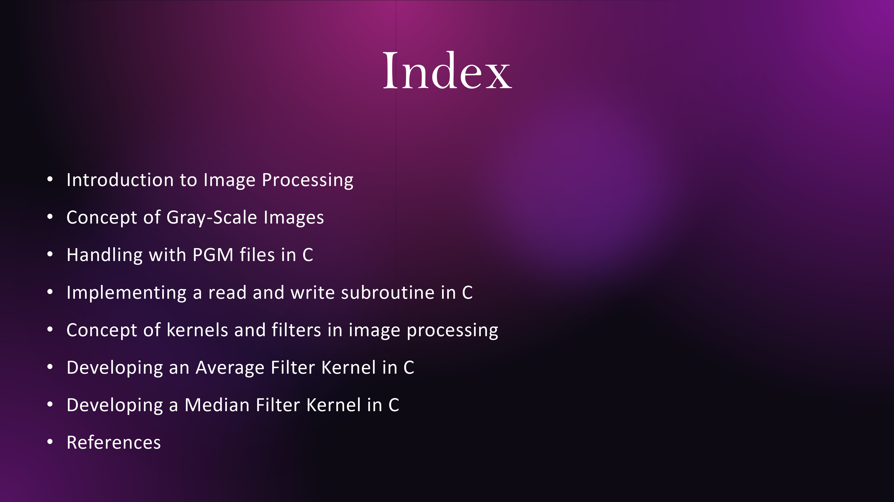

# Image Processing in C
This project outlines the image processing concepts with implementation in C.

Here we have dealt with numerous concepts ranging from basic read and write operations of PGM files to filtering and applying morphological concepts on the images.

We have dealt with grayscale images in this project.

All the relevant source code and documentation can be found [here](https://github.com/FardeenCODEIIEST/Image-Processing-in-C)

## Acknowledgements
 - [Image Processing in C](https://homepages.inf.ed.ac.uk/rbf/BOOKS/PHILLIPS/cips2ed.pdf)
 - [Digital Image Processing](https://en.wikipedia.org/wiki/Digital_image_processing)
 - [Convolution Kernel](https://en.wikipedia.org/wiki/Kernel_(image_processing))
 - [Image Morphology](https://en.wikipedia.org/wiki/Mathematical_morphology)
 - [Character Segmentation](https://towardsdatascience.com/segmentation-in-ocr-10de176cf373)

## Slides

The working of a kernel-convolution can be visualised here.

## Character Segmentation

The working of the above vertical scan algorithm can be understood from the media below

